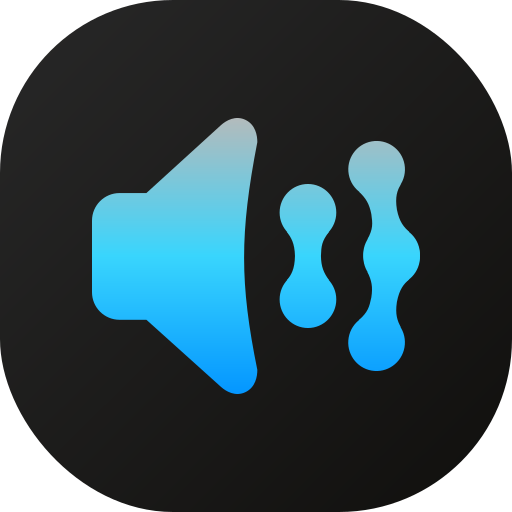

<p align="center">
  
</p>

<h1 align="center">AuStream</h1>

<p align="center">
  <strong>Stream your PC's audio to multiple Android devices in perfect sync</strong>
</p>

<p align="center">
  
  
  
  
</p>

---

AuStream captures system audio from your Windows PC and streams it wirelessly to multiple Android phones/tablets simultaneously. All devices stay synchronized, creating a seamless multi-room audio experience.

## ✨ Features

| Feature | Description |
|---------|-------------|
| 🔊 **System Audio Capture** | Stream any audio playing on your PC |
| 📱 **Multi-Device Sync** | Connect multiple Android devices, all playing in sync |
| 🔐 **Secure Connection** | PIN-based authentication with AES-256-GCM encryption |
| 📷 **QR Code Pairing** | Scan to connect instantly - no manual IP entry needed |
| ⚡ **Low Latency** | Optimized for real-time audio with ~50ms sync buffer |
| 🎚️ **Volume Control** | Independent volume control on each device |

## 🔧 How It Works

```
┌─────────────────┐         UDP/WiFi          ┌─────────────────┐
│   Windows PC    │ ─────────────────────────▶│  Android Phone  │
│                 │                           │                 │
│  WASAPI Capture │    Encrypted Audio +      │  Synced Playback│
│  + Timestamps   │    Clock Sync Protocol    │  via Timestamps │
└─────────────────┘                           └─────────────────┘
                                                      │
                                              ┌───────┴───────┐
                                              ▼               ▼
                                         📱 Phone 2     📱 Phone 3
                                         (All in sync)
```

1. **Server** captures system audio using WASAPI loopback
2. Audio frames are timestamped and encrypted with AES-256-GCM
3. **Clients** use NTP-like clock synchronization to calculate offset
4. Each device schedules playback based on synchronized timestamps

## 📋 Requirements

### Server (Windows)
- Windows 10 or 11
- Java 17 or higher
- Gradle 8.5+

### Client (Android)
- Android 8.0+ (API level 26)
- Camera permission (for QR scanning)
- WiFi connection on the same network as the PC

## 🚀 Getting Started

### Running the Server

```bash
cd austream-server
./gradlew run
```

The server will display:
- A QR code for easy pairing
- The IP address and port
- A 6-digit PIN for authentication

### Building the Android App

```bash
cd austream-android
./gradlew assembleDebug
```

Install `app/build/outputs/apk/debug/app-debug.apk` on your device(s).

### Connecting

1. Open AuStream on your Android device
2. Scan the QR code displayed on the PC, **or** tap "Enter manually"
3. Enter the 6-digit PIN shown on the server
4. Audio starts streaming automatically!

## 📁 Project Structure

```
austream/
├── austream-server/          # Windows desktop server
│   └── src/main/kotlin/com/austream/
│       ├── Main.kt           # Application entry point
│       ├── audio/            # WASAPI capture & encoding
│       ├── network/          # UDP streaming & clock sync server
│       ├── security/         # PIN generation & AES encryption
│       └── ui/               # Compose Desktop UI
│
└── austream-android/         # Android client app
    └── app/src/main/java/com/austream/client/
        ├── audio/            # AudioTrack playback & jitter buffer
        ├── network/          # UDP receiver & clock sync client
        ├── security/         # PIN hashing & AES decryption
        ├── service/          # Foreground streaming service
        └── ui/               # Jetpack Compose UI
```

## ⚙️ Technical Specifications

| Component | Details |
|-----------|---------|
| **Audio Format** | 48kHz, 16-bit signed, stereo PCM |
| **Frame Size** | 480 samples (10ms @ 48kHz) |
| **Transport** | UDP unicast with custom packet format |
| **Encryption** | AES-256-GCM with per-packet IV |
| **Authentication** | SHA-256 hashed PIN |
| **Sync Protocol** | NTP-like 4-timestamp exchange |
| **Jitter Buffer** | 50ms adaptive with PLC |
| **Sync Accuracy** | ~10-20ms between devices |

## 🖼️ Screenshots

*Coming soon*

## 🤝 Contributing

Contributions are welcome! Feel free to:

1. Fork the repository
2. Create a feature branch (`git checkout -b feature/amazing-feature`)
3. Commit your changes (`git commit -m 'Add amazing feature'`)
4. Push to the branch (`git push origin feature/amazing-feature`)
5. Open a Pull Request

## 👤 Author

**Rishi**

---

<p align="center">
  Made with ❤️ for seamless audio streaming
</p>
